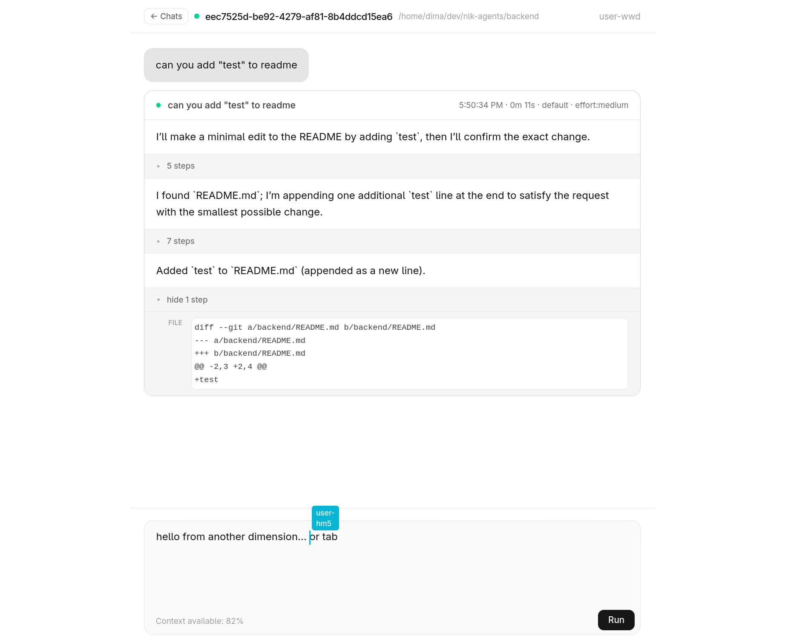

# Codex Room



This is an early experimental idea.

A friend and I were building a game, and I thought it would be useful to see Codex output in real time while also being able to edit prompts collaboratively, similar to Google Docs.

That is exactly how Codex Room works today.

In the future, I plan to add:
- A simple proxy backend so Codex Room can create a public tunnel automatically with token-based access.
- Better sandboxing so access is limited to the directory where the app was started.

## How to run

```bash
codex-room start
```

Example output:

```text
Codex Room started for: /home/dima/dev/bones
Room: 46acb1f2-004c-423a-8ab6-e40c8a83d906
Local URL: http://localhost:3001?room=46acb1f2-004c-423a-8ab6-e40c8a83d906
Share URL: http://192.168.1.230:3001?room=46acb1f2-004c-423a-8ab6-e40c8a83d906
Press Ctrl+C to stop.
```

If you do not want to run the built-in relay flow, you can still create a tunnel manually with tools like ngrok or Cloudflare Tunnel.

## Public relay sharing

`codex-room` can now publish a room through a relay service.

Start the relay:

```bash
bun run dev:relay
```

Or run it directly:

```bash
bun run --cwd relay src/index.ts
```

Then start a room and publish it through the default public relay:

```bash
codex-room start --publish
```

Example output:

```text
Public URL: http://127.0.0.1:3010/r/abc123...
Invite expires: 2026-03-14T14:40:39.161Z
Relay viewer limit: 4
```

The relay generates the public URL on the server side. By default the CLI publishes through `https://codex-room.hrebeni.uk`. Use `--relay-url <url>` to override that for a local or self-hosted relay.

### Relay environment

- `HOST`: bind host for the relay process. Defaults to `127.0.0.1`.
- `PORT`: bind port for the relay process. Defaults to `3010`.
- `RELAY_PUBLIC_BASE_URL`: public base URL used when generating invite links.
- `RELAY_SESSION_TTL_SECONDS`: default invite TTL.
- `RELAY_MAX_VIEWERS`: default viewer limit per share.
- `RELAY_COOKIE_SECURE`: force `Secure` cookies (`1`/`true`).

## Developer setup

### 1) Install dependencies

```bash
bun install
```

### 2) Link the CLI locally

```bash
bun link
```

After linking, `codex-room` should be available in your shell, launch it from any folder:

```bash
codex-room start
```

### 3) Run in development mode (in folder of codex-room for now)

Run backend + frontend together:

```bash
bun run dev:backend
bun run dev:frontend
```

Relay in development:

```bash
bun run dev:relay
```
